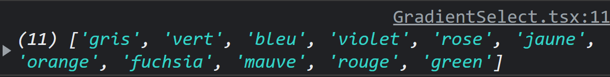
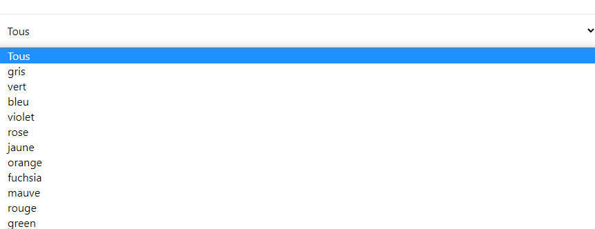
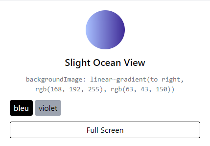
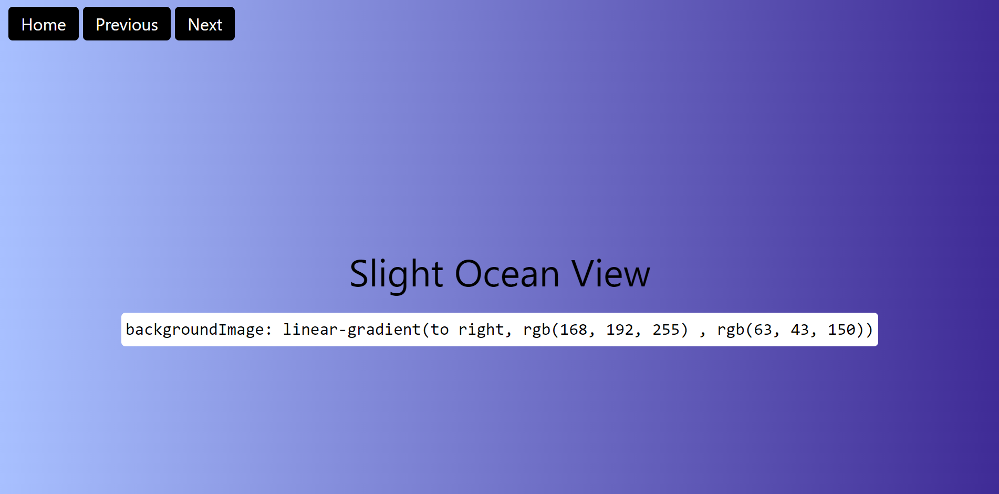

# <h1 align="center">Gradients</h1>


# cra-template-redux-typescript

```
npx create-react-app my-app --template redux-typescript
```

## Description

Site de différent gradients avec un extrait et leur code couleur.

- [Installation](https://github.com/Westindiess/TS-Gradient-Redux#installation)
- [Redux](https://github.com/Westindiess/TS-Gradient-Redux#redux)
  - [Store](https://github.com/Westindiess/TS-Gradient-Redux#store)
  - [Slice](https://github.com/Westindiess/TS-Gradient-Redux#slice)
    - [dataSlice](https://github.com/Westindiess/TS-Gradient-Redux#dataSlice)
    - [filterTagSlice](https://github.com/Westindiess/TS-Gradient-Redux#filterTagSlice)
- [Fonctions](https://github.com/Westindiess/TS-Gradient-Redux#fonctions)
  - [allTags](https://github.com/Westindiess/TS-Gradient-Redux#allTags)
  - [filterByTags](https://github.com/Westindiess/TS-Gradient-Redux#filterByTags)
- [Composants](https://github.com/Westindiess/TS-Gradient-Redux#composants)
  - [App](https://github.com/Westindiess/TS-Gradient-Redux#app)
  - [GradientHeader](https://github.com/Westindiess/TS-Gradient-Redux#GradientHeader)
  - [GradientSelect](https://github.com/Westindiess/TS-Gradient-Redux#GradientSelect)
  - [GradientCard](https://github.com/Westindiess/TS-Gradient-Redux#GradientCard)
  - [GradientCardList](https://github.com/Westindiess/TS-Gradient-Redux#GradientCardList)

## Installation

```
npm install

npm start
```

# Redux

## Store

```js
// src/app/store.ts

import { configureStore } from "@reduxjs/toolkit";
import dataSlice from "../features/data/dataSlice";
import filterTagSlice from "../features/filterTag/filterTagSlice";

export const store = configureStore({
  reducer: {
    loadDataSlice: dataSlice,
    filterTag: filterTagSlice,
  },
});

export type RootState = ReturnType<typeof store.getState>;
export type AppDispatch = typeof store.dispatch;
```

Mise en place du store avec `configureStore`

## Slice

### **dataSlice**

```js
// src/features/data/dataSlice.ts

import { createSlice, PayloadAction } from "@reduxjs/toolkit";

export const dataSlice = createSlice({
  name: "data",
  initialState: {
    data: [],
    loading: true,
    error: "",
  },
  reducers: {
    setData: (state, action: PayloadAction<[]>) => {
      return {
        ...state,
        data: action.payload,
        loading: false,
        error: "",
      };
    },
    setLoading: (state, action: PayloadAction<boolean>) => {
      return {
        ...state,
        loading: action.payload,
      };
    },
    setError: (state, action: PayloadAction<string>) => {
      return {
        ...state,
        error: action.payload,
        loading: false,
      };
    },
  },
});

export const { setData, setLoading, setError } = dataSlice.actions;
export default dataSlice.reducer;
```

Mise en place des différentes actions avec `createSlice`

- **setData** fetch les données
- **setLoading** Indique que la page est entrain de charger
- **setError** Affichera un message d'erreur lorsqu'il y en aura une

Export des actions et du reducer

### **filterTagSlice**

```js
// src/features/filterTag/filterTagSlice.ts

import { createSlice, PayloadAction } from "@reduxjs/toolkit";

export const filterTagSlice = createSlice({
  name: "filter",
  initialState: {
    tags: "All",
  },
  reducers: {
    setFilter: (state, action: PayloadAction<string>) => {
      return { ...state, tags: action.payload };
    },
  },
});

export const { setFilter } = filterTagSlice.actions;
export default filterTagSlice.reducer;
```

Mise en place de l'action avec `createSlice`

- **setFilter** filtre les cards par leurs tags de couleur

Export de l'action et du reducer

# Fonctions

## **_allTags_**

```js
// functions/alltags.ts

const allTags = (array: any[]) => {
  let listTag: string[] = [];
  for (let element of array) {
    if (array.includes(element)) {
      listTag = listTag.concat(element.tags);
    }
  }
  let uniqueTagList: string[] = [];
  listTag.forEach((element) => {
    if (!uniqueTagList.includes(element)) {
      uniqueTagList.push(element);
    }
  });
  return uniqueTagList;
};

export default allTags;
```

Création d'une fonction `allTags` qui prend en paramètre un tableau.

Itération sur le tableau `array`.
Récupèration de tout les tags de ce tableau pour chaque élément.

On applique ensuite au tableau `listTag` le méthode `concat` pour chaque tag.
Ils sont contenu dans des tableaux, donc en appliquant cette méthode, on les récupère tous dans un seul et même tableau.

Le tableau `uniqueTagList` sera un tableau qui contiendra chaque couleurs en 1 fois.
Pour ce faire, on itérera sur `listTag` avec une boucle.
On applique ensuite la méthode `push` à `uniqueTagList` seulement s'il ne contient pas déjà l'élément en question, puis on le retourne.

On se retrouve donc avec un tableau composé de chaque couleurs.



## **filterByTags**

```js
// functions/filterByTag.ts

export const filterByTag = (data: [], filter: string, value: string) => {
  const list = data.filter((el: any) => {
    if (filter === value) {
      return true;
    }
    return el.tags.includes(filter);
  });
  return list;
};
```

Cette fonction prend en paramètre un **tableau** `data`, notre **filtre** créé avec redux qui a pour valeur initial `All` et une **valeur** `All`.  
Elle permett de retourner tout les tags si le filtre est égale à la valeur ( si **All** === **All** ).  
Sinon, on retourne le tag de couleur qui correspond à l'élément sur lequel on a cliqué ( si on clique sur vert, seul les gradients composé de vert seront affiché ).

# Composants

## App

```js
//components/App.tsx

const App = () => {
  const loading = useSelector(
    (state: RootState) => state.loadDataSlice.loading
  );
  const data = useSelector((state: RootStateOrAny) => state.loadDataSlice.data);
  const error = useSelector((state: RootState) => state.loadDataSlice.error);
  const dispatch = useDispatch<AppDispatch>();

  const chooseGradient = () => Math.floor(Math.random() * data.length);
  const [randomGradient, setRandomGradient] = useState<number>(chooseGradient);

  const style = {
    backgroundImage: `linear-gradient(to right, ${data[randomGradient]?.start}, ${data[randomGradient]?.end})`,
  };

  const { id } = useParams as any;

  useEffect(() => {

    dispatch(setLoading(loading));

    const fetchData = async () => {
      try {
        const result = await axios.get(
          `https://gradients-api.herokuapp.com/gradients`
        );
        dispatch(setData(result.data));
      } catch (error: any) {
        dispatch(setError(error.message));
      }
    };

    fetchData();

  }, [dispatch, loading, id]);

  const handleReloadClick = () => {
    setRandomGradient(chooseGradient);
  };

  const handleNextClick = () => {
    setRandomGradient(
      randomGradient === data.length - 1 ? 0 : randomGradient + 1
    );
  };

  const handlePrevClick = () => {
    setRandomGradient(
      randomGradient === 0 ? data.length - 1 : randomGradient - 1
    );
  };

  return (
    <>
      <GradientHeader
        style={style}
        handleReloadClick={handleReloadClick}
        handleNextClick={handleNextClick}
        handlePrevClick={handlePrevClick}
      />
      <div className="px-5 pt-5 lg:px-20">
        <GradientSelect />
        {loading && <Loading />}
        {error && <h1>{error}</h1>}
        <GradientCard />
      </div>
    </>
  );
};
```

Récupération des données API.  
Gestion du chargement de la page et des éventuelles erreurs.

Initialisation de le fonction **ChooseGradient** qui permet de récupérer un nombre aléatoire entre 0 et le nombre d'élément contenu dans data.

La variable `randomGradient` à pour valeur initiale `chooseGradient` ( un nombre aléatoire ).  
Chaque fois que la page sera mise à jour ou qu'on clique sur le boutton, une couleur sera affiché ( **_grâce à la fonction `handleReloadClick`_** ) en tant que **backgroundColor** du Header qui dépendra du numéro aléatoire.

Les fonctions `handleNextClick` et `handlePreviousClick` permettent de choisir respectivement la couleur suivante ou précédente.

Initialisation des variable **data** et **filter** auxquelles sont affecté une fonction ( `Selector` ) qui prend en paramètre leur state initial respectif déclarer dans redux.

## GradientHeader

```js
// components/GradientHeader.tsx

interface ChangeColor {
  style: {};
  handleReloadClick: () => void;
  handleNextClick: () => void;
  handlePrevClick: () => void;
}

const GradientHeader: React.FC<ChangeColor> = ({
  style,
  handleReloadClick,
  handleNextClick,
  handlePrevClick,
}) => {
  return (
    <div className="text-center text-white py-10 w-full" style={style}>
      <h1 className="text-5xl md:text-6xl lg:text-7xl pb-2">Gradient</h1>
      <p className="sm:text-xl md:text-2xl lg:text-3xl">
        Ultime collection de dégradés
      </p>
      <div className="pt-4">
        <button
          className="border-white border w-10 h-10 mr-2 rounded"
          onClick={handlePrevClick}
        >
          
        </button>
        <button
          className="border-white border w-10 h-10 mr-2 rounded"
          onClick={handleReloadClick}
        >
          
        </button>
        <button
          className="border-white border w-10 h-10 rounded"
          onClick={handleNextClick}
        >
          
        </button>
      </div>
    </div>
  );
};
```


## GradientSelect

```js
// components/GradientSelect.tsx

const GradientSelect: React.FC = () => {

  const data = useSelector((state: RootStateOrAny) => state.loadDataSlice.data);
  const dispatch = useDispatch<AppDispatch>();
  const uniqueTags: string[] = allTags(data);

  return (
    <div className="flex justify-center items-center ">
      <label
        className="border-2 text-xl bg-gray-200 p-2 rounded-l-md"
        htmlFor="select"
      >
        Filtre
      </label>
      <select
        className="rounded-r-md p-3 outline-none w-full bg-white border xl:w-3/6"
        onChange={(e) => dispatch(setFilter(e.target.value))}
        id="select"
      >
        <option value="All">Tous</option>
        {uniqueTags.map((el) => (
          <option key={el}>{el}</option>
        ))}
      </select>
    </div>
  );
};
```

Itération sur le tableau de tags de couleur puis affichage dans le form-select.



## GradientCard

```js
// components/GradientCard/GradientCard.tsx

const GradientCard: React.FC = () => {
  const data = useSelector((state: RootStateOrAny) => state.loadDataSlice.data);
  const filter = useSelector((state: RootState) => state.filterTag.tags);
  const list = filterByTag(data, filter, "All");

  return (
    <ul>
      {list.map((el: Elem) => (
        <li key={el.id}>
          <GradientCardList
            name={el.name}
            colorStart={el.start}
            colorEnd={el.end}
            tags={el.tags}
            id={el.id}
          />
        </li>
      ))}
    </ul>
  );
};
```

## GradientCardList

```js
// components/GradientCard/GradientCardList.tsx
// voir aussi GradientCode.tsx, GradientName.tsx, GradientPill.tsx, GradientTagButton.tsx

interface Elem {
  name: string;
  colorStart: string;
  colorEnd: string;
  tags: string[];
  id: number;
}

const GradientCardList: React.FC<Elem> = ({
  name,
  colorStart,
  colorEnd,
  tags,
  id,
}) => {
  return (
    <div>
      <GradientPill colorStart={colorStart} colorEnd={colorEnd} />
      <GradientName name={name} />
      <GradientCode colorStart={colorStart} colorEnd={colorEnd} />
      <GradientTagButton tags={tags} />
      <FullScreenButton id={id} />
    </div>
  );
};
```

Affiche les élément contenu dans les cards.

Le composant `GradienTagButton` affiche les bouttons avec le nom des couleurs contenu dans les pastilles.  
Lors d'un clique, affiche toutes les **cards** contenant cette couleur et le bouton se désactive.



Le composant `FullScreenButton` est un bouton qui redige vers le composant `FullScreenPage`.  
La couleur sélectionné sera affiché en plein écran avec son nom et son code couleur.

Sur cette autre page, on aura aussi 3 boutons:

- **Home**: pour retourner sur la page d'acceuil
- **Next**: pour sélectionner le dégradé suivant
- **Previous**: pour sélectionner le dégradé précédent

  
